# Bootstrap介绍
## 简介
    4.0以前用less编写源码，4.0以后用sass进行编写源码，现在4.0以前版本的sass方案是后面迁移过去的。4.0以后将不再兼容IE8
**less学习地址：__http://lesscss.cn/__**
### 安装less
 **通过node.js的包管理器进行安装(要提前安装node.js环境)**

    lessss官方有一款基于node.js的库用于编译less
    使用时首先安装less
    全局安装：npm install -g less
    本地安装：npm install less(要先定位到你要安装的目录)

#### 编译less—css
**输入lessc命令可以查看less转css的参数**

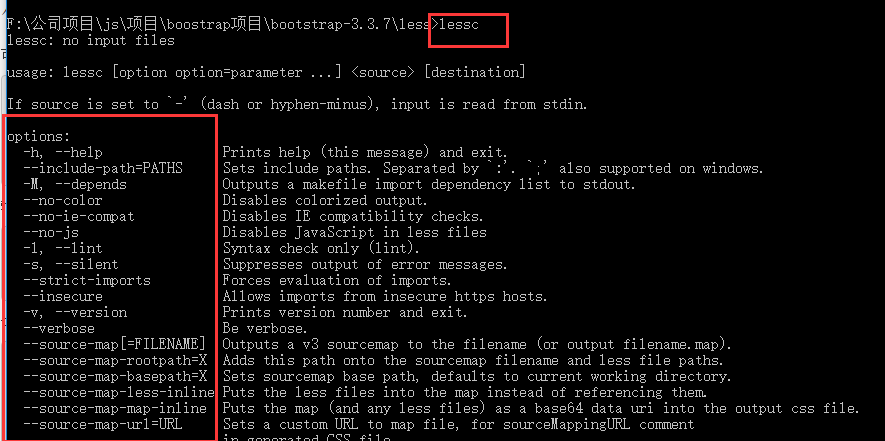

**编译less为cass**

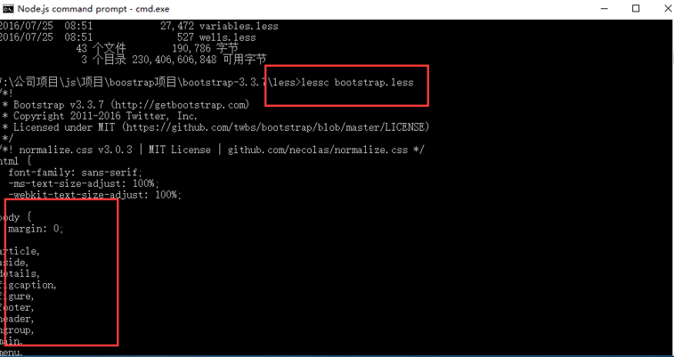

**输出为bootstrap.css**

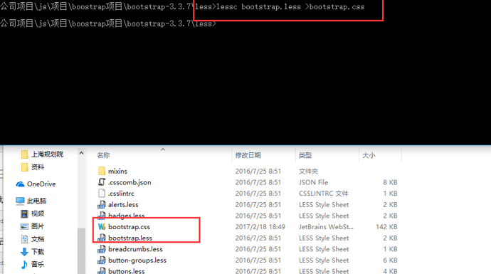

### 2.通过idea或者webstrom安装lessc-plugin进行安装后，可以通过该编译器进行编译

1.打开菜单栏  —>  点击 Intellij IDEA  —>  选择Preferences，左侧搜索框 搜索Plugins，  
再点击右下方的“Install plugin from disk…”按钮

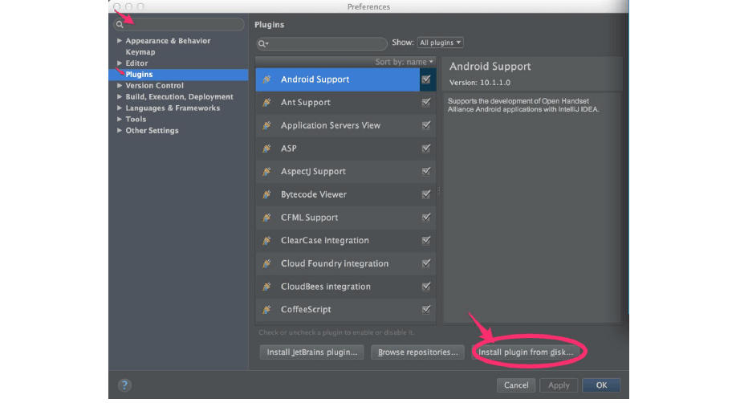

2.找到本地已下载好的less-plugin.zip压缩包
**(我已经下地址：./lessc-plugin.rar)**

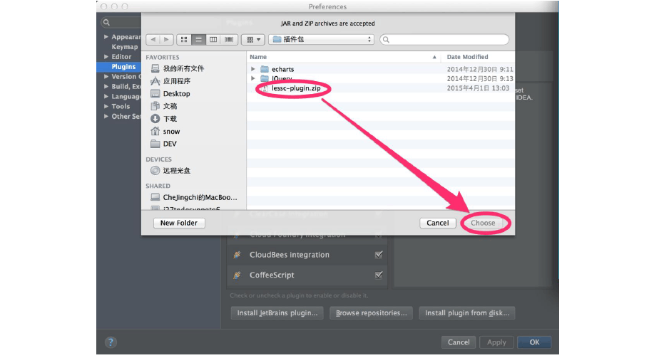

3.选择之后 —>  Plugins下多了一个LESS CSS Compiler选项，点击apply

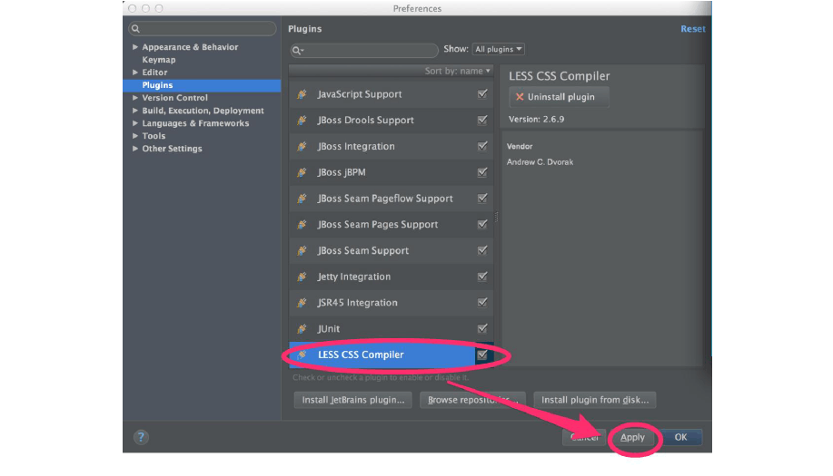

### 3.可以通过其他专门的编译器进行编译。

## bootsrtap优缺点

#### 优点：
     1. 快速搭建一个网站前端，界面风格比较统一（假设没用美工的前提下这是一个不错的解决方案）
     2. 自适应多种浏览器终端
     3. 开源，有自己的一套前端机制，自己可以进行修改甚至定制

### 缺点：

    1. 在长时间的产品开发过程中，可能会引入其他第三方框架，导致项目难以维护。
    2. 更加偏向于样式的的显示和调整对数据加载方面没有其他框架有优势。

# 定制自己的boostrap
## 1.覆盖css
使用CSS覆盖

最直接的方式是用CSS覆盖掉Bootstrap的默认样式。可以通过针对Bootstrap中使用的class编写你自己的样式来实现。比如说，可以通过增加以下代码来使你的按钮变得更圆滑：
### 优点：
    会改变你的工作流程。你可以快速直接修改你的样式，即使是你的网站引用了其他的类似bootstrap的框架样式，你都可以在同一个地方进行统一的定制。
### 缺点：
    这种覆盖样式更像是一种打补丁式的解决方案，如果碰到要修改比较大的地方，改动量会比较大，最样式表的体积也会增大
## 2.生成一个自定义构建
    一个替代方案是创建一个彻底的自定义构建。借助官方的生成器，你可以将框架内使用的关键变量设置成自己需要的值，比如说 @linkColor，@navbarHeight 和 @baseFontFamily。点击生成器页面底部的大按钮就可以下载最终的样式表。你甚至还能对框架包含的组件进行挑选，这样能够减少文件的体积。
    定制好你的变量后点击download按钮就会生成一套属于你的bootstrap框架了。同时，网上还有很多类似定制bootstrap的网站，如果你不习惯官网的可以去这其它的网站试试，比如Bootswatchr网站使用变量来组织，而StyleBootstrap则使用组件。BootTheme添加了扔骰子特性来随机设置值。如果幸运女神不站在你这边，Lavish能够根据你提供的任何图片来生成一个主题，PaintStrap则是根据已有的配色方案来生成
### 优点：
    相比上一种方法，它简便了你对整体网站的修改。
### 缺点：
    首先你很难一开始就确定网站所有的样式风格，当然你可以在确定好了后再生成一个最终版本。所以这就引入一个问题，如果你还要时不时更换你的样式，你同样需要找到bootstrap样式源文件编辑，你可能还要用到第一种方法，比如我要使用圆角的带阴影的button，光定制就不能满足我的需求，再者，如果面对bootstrap升级的问题，你还需要重新根据你的样式构建一个新版本的bootstrap，这样要真的做起来，会非常的麻烦。

## 3.深度定制bootstrap less
    打开源码，你会发现Bootstrap的样式是用LESS而不是CSS写的。LESS 是一种动态样式表语言，相比于CSS，它支持多种优秀特性，包括选择器嵌套，创建变量(就像在上面生成器中使用的)。一旦写完，你可以选择将LESS代码预先或在运行时编译成 CSS。如果你喜欢 Sass，可以使用这个适用于Sass的Bootstrap。
    实际上，bootstrap是通过编译bootstrap.less这一个文件而生成整个bootstrap.css文件的。我们看到bootstrap.less的作用仅仅是引入其他文件
### 以下这些文件是你要注意的：
#### bootstrap.less:
    这个是核心文件。它用来引入其他文件，最终由你来编译它。
#### reset.less:
    始终是最先引入的文件。
#### variables.less 和 mixins.less:
    这两个文件总是同时出现，因为其他文件都依赖于它们。前一个文件包含了在生成器网站上使用的相同的变量。
#### utilities.less
    这个文件总是最后引入，你可以把想要覆盖的类写到这里。

#### 我们定制的思路
    找到我们需要定制的组件和相对应的变量，对其修改，然后编译成我们自己的bootstrap.css即可。
### 下面讲讲具体实现方法。
    确保你已经安装好Less, 为了不让我们修改的内容与原始文件重合在一起，我们需要模块化的修改。
    首先下载bootstrap源码，下载后就不需要对其做任何的改动了。我们单独建立一个文件夹（文件目录只要能引用到bootstrap的less文件就可以），取名为custom-bootstrap，其中包含以下三个文件：
#### custom-variables.less:
    这个文件包含你要定制的变量。
#### custom-other.less:
    这个文件中包含了那些无法通过修改变量完成定制的内容，比如增加或禁用button的text-shandow属性。
#### custom-bootstrap.less
    这是新的「核心」文件。我们将把它编译成CSS。与原始的 LESS文件一样，它使用下面的命令来引入上面那两个自定义文件（记住要保证文件正确的引用顺序）

1.  @import "../bootstrap/less/bootstrap.less"; //这个引用到原有的bootstrap文件 
2.  @import "custom-variables.less"; 
3.  @import "custom-other.less"; 4 @import "../bootstrap/less/utilities.less";
    //我们同样要引用原生的utilities.less，因为我们要保证该文件始终最后一个被导入
#### 这时，我们只要编译custom-bootstrap.less就可以了。
    有一些需要注意的是，custom-variables.less 不需要拷贝原有文件的所有内容，只需要拷贝和你要定制的组件相关的变量就可以了，如果你这样做了，单独编译custom-variables.less或custom-other.less会提示缺少变量定义的错误，但这没关系，你只要保证编译custom-bootstrap.less没有错误就可以了。
    这种方法的优点在于，将定制的变化与原有库代码很好的隔离，却又不失可维护性。即使今后升级bootstrap版本，我们也不要担心重新构建样式框架了。
### 我选择第三种深度定制bootstrap的解决方案进行研究探索

# Boostrap源码介绍
## Bootstrap整体架构
### 架构图
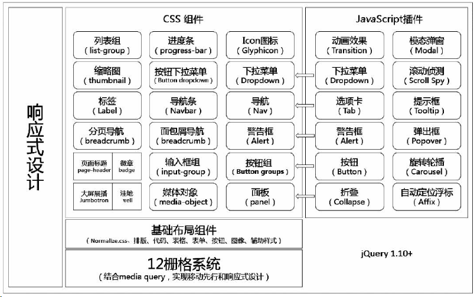
### Bootstrap源码文件目录介绍
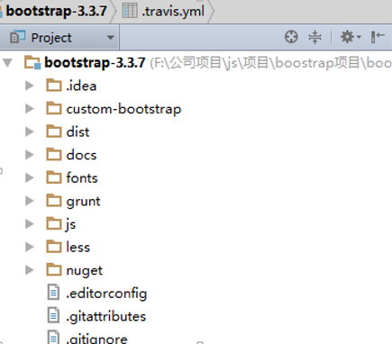
#### custom-bootstrap：
    是我自己建的目录，里面主要自己根据bootstrap规范定义的组件。
#### less、js 和 fonts ：
    目录分别包含了 CSS、JS 和字体图标的源码。
#### dist: 
    目录包含了预编译 Bootstrap 包内的所有文件。
#### docs：
    包含了所有文档的源码文件，里面examples 目录是 Bootstrap 官方提供的实例工程。除了这些，其他文件还包含 Bootstrap 安装包的定义文件、许可证编。
### 主要文件是less和js下的源码文件：
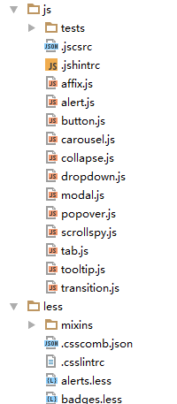
### 关键的文件
#### 1.bootstrap.less
    为整个框架的入口里面主要是加载了bootstrap框架的所有的组件的less文件，最后也是我们编译成bootstrap.css文件的主要文件
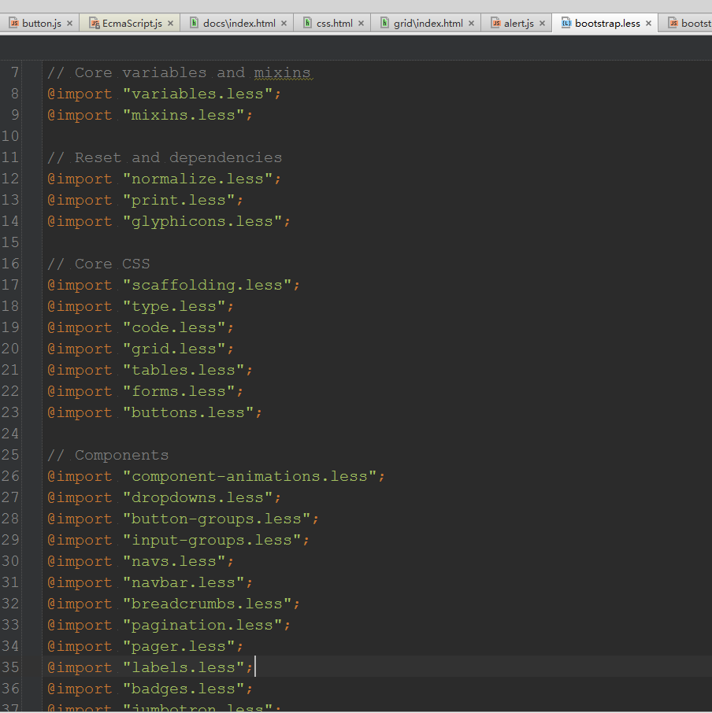
#### 2.variable.less
    这个是定义bootstrap的基本变量的css属性，这里面会用到一些less的自带方法进行修改变量的值。
 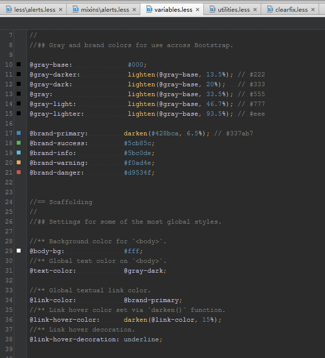
 #### 3.utilites.less
    公共定义文件，也可以理解为公用的“动作”，因为它里面定义了诸如“左浮动”，“右浮动”之类的动作，任何html标签只要加上定义在此文件里面动作，就可以产生相应的效果但是当前源码中这个文件定义的动作并不多。
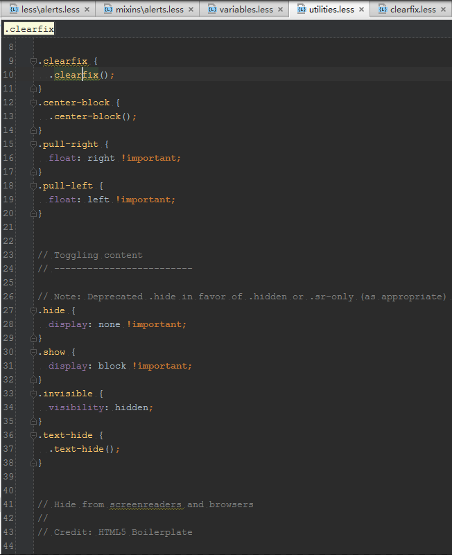
#### 4.mixins文件夹
    你会发现mixins文件夹下的大部分文件在less下有相同的名字，即使不同也是有关系的，关系就是，less下的文件调用了mixins文件夹里面的文件的方法，可以理解为一种另类的继承
 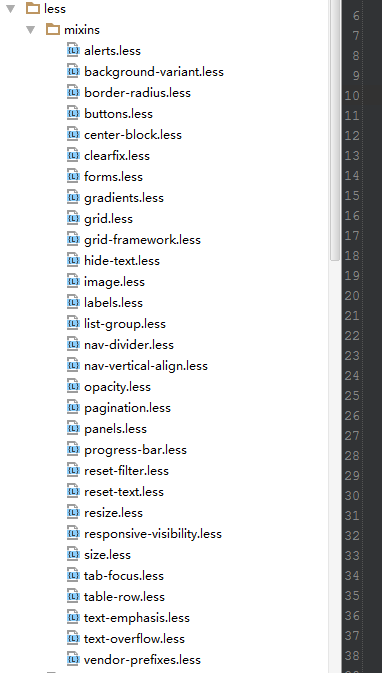
 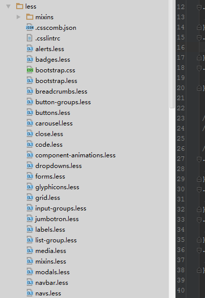
 ##### less下的alert.less文件的方法
 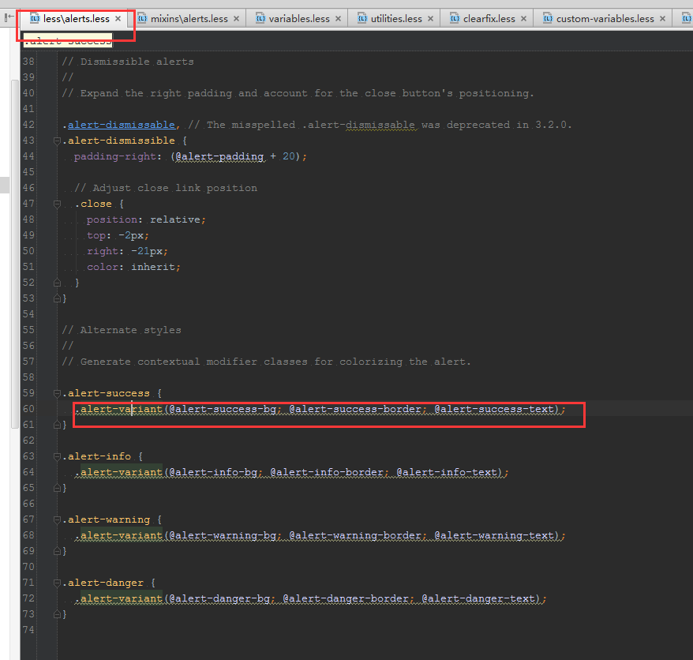
##### mixins下的alert.less的方法
 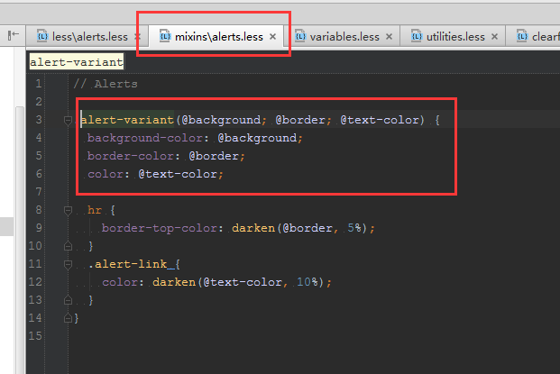
# 举例介绍bootstrap源码
## 待续。。。

